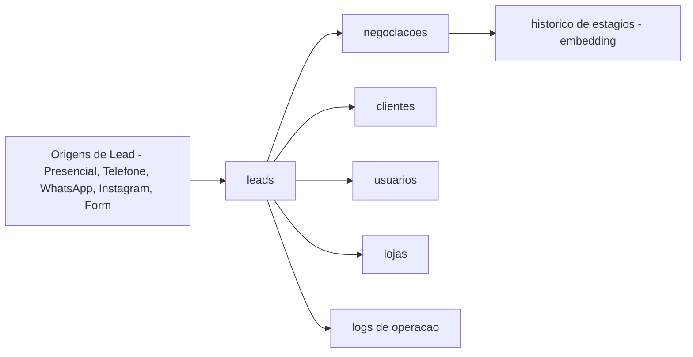

# FATEC - BDN 2026/1 - Sistema de Gestao de Leads (MongoDB)

Repositorio da atividade de Banco de Dados Nao Relacional (MongoDB), tema **1000 Valle Multimarcas**.

## Estrutura

- `Requisitos-ABP/README.md`: guia de entrega da atividade.
- `documentacao/modelagem.c4`: arquitetura e modelagem com foco em C4 + Mermaid.
- `documentacao/justificativas.md`: decisoes de embedding/referencing e vantagens do modelo.
- `documentacao/consultas-e-aggregations.md`: consultas obrigatorias e pipelines de dashboard.

## Escopo da Entrega

- Colecoes obrigatorias: `clientes`, `leads`, `usuarios`, `negociacoes`, `logs`, `lojas`.
- Regras de negocio atendidas (lead-cliente, lead-loja-atendente, negociacao ativa unica, historico, status/estagio).
- Consultas com filtros, projecao, ordenacao e paginacao.
- Aggregations para indicadores gerenciais.

## Visao Rapida da Solucao

## Como Usar

1. Utilizar `documentacao/modelagem.c4` como guia de estrutura e relacoes.
2. Usar `documentacao/consultas-e-aggregations.md` como base das consultas obrigatorias e dashboard.
3. Consolidar justificativas em `documentacao/justificativas.md`.
4. Gerar prints em tela inteira e consolidar no PDF `BDN-Documento-ABP.pdf`.

